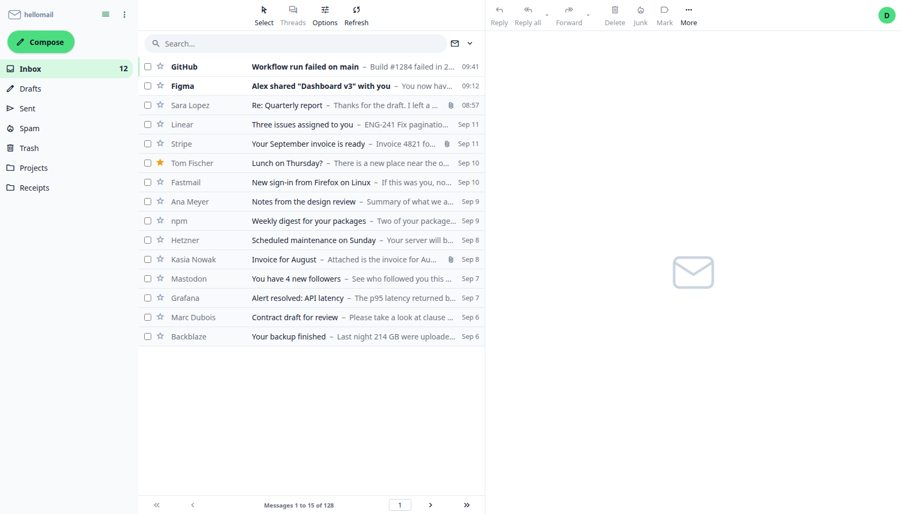
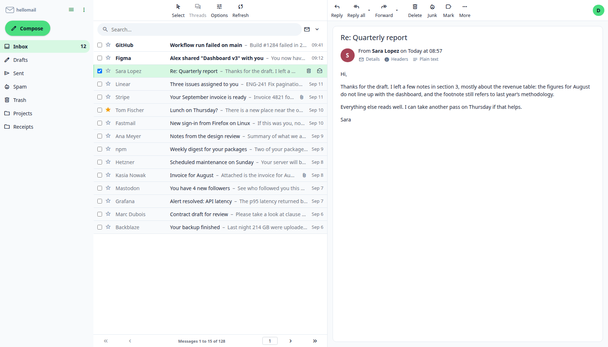
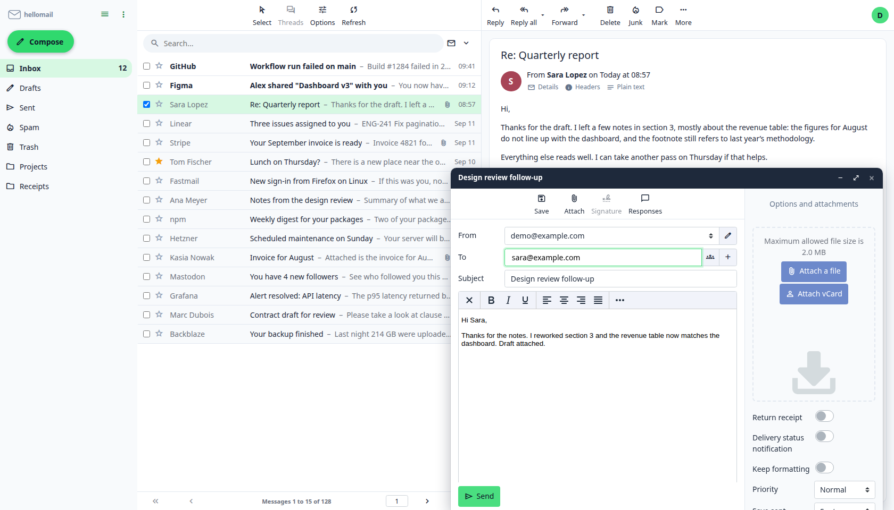
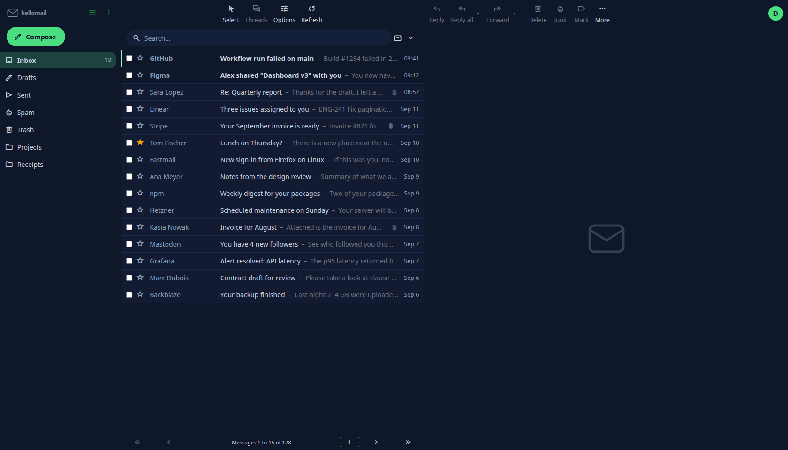

# hellomail

A Gmail-like skin for Roundcube 1.6.x, with a small companion plugin. It **extends** the
bundled Elastic skin (`"extends": "elastic"` in `meta.json`): every template,
script and asset that is not overridden here is served from Elastic at runtime,
so Roundcube package upgrades keep working without touching this repository.



| Reading | Compose | Dark mode |
| --- | --- | --- |
|  |  |  |

The screenshots use sample content, not a real mailbox.

## Features

- Gmail-like layout on top of Elastic: no task rail on wide screens, the logo
  and a Compose pill on top of the folder sidebar, folder list with rounded
  selection and plain unread counts, collapsible to icons.
- One-line message rows on wide screens: checkbox, star, sender, subject, body
  snippet, date; hover actions for archive, delete and mark read/unread; a
  selectable list density.
- Search as a rounded pill, white top bars, and an account button with the
  user's initial whose menu holds Mail, Contacts, Settings, the dark mode
  switch and Logout.
- Message view as a card with an initials avatar and attachment chips.
- Floating compose card bottom-right for new messages, replies and forwards;
  full-page compose on narrow screens.
- Six colour themes selectable per user in Settings, dark mode for all of
  them, Material Symbols icons and a system font stack.
- Everything else (responsive layouts, keyboard shortcuts, plugin UIs, login
  page) is Elastic's and keeps working across Roundcube upgrades.

Requires Roundcube 1.6.x with the bundled Elastic skin. Built and tested
against 1.6.6.

## Layout

| Path | Purpose |
| --- | --- |
| `install.sh` | One-command installer; also uninstalls. |
| `hellomail/` | The skin. This directory is what gets installed. |
| `hellomail/meta.json` | Skin metadata, `extends: elastic`, config overrides. |
| `hellomail/styles/styles.less` | Entry point: imports Elastic's full stylesheet. |
| `hellomail/styles/_variables.less` | Elastic variable overrides (colours, sizes). |
| `hellomail/styles/_styles.less` | Custom rules that variables cannot express. |
| `hellomail/styles/styles.css`, `styles-<theme>.css` | Compiled output, one file per theme. Committed; the server has no Node. |
| `hellomail/templates/` | Overridden Elastic templates, each listed in `OVERRIDES.md`. |
| `hellomail/styles/themes/` | Colour themes, four variables each. |
| `plugins/hellomail/` | Companion plugin: colour theme preference and body snippets for the list. |
| `OVERRIDES.md` | Every overridden template, why, and the Elastic version it came from. |
| `CHANGELOG.md` | Release notes. |
| `docs/screenshots/` | README images. |
| `docs/UPGRADE.md` | What to re-check after a Roundcube package upgrade. |

## How the styling works

Elastic's `variables.less` ends with `@import (reference, optional) "_variables";`
and its `styles.less` ends with `@import (optional) "_styles";`. Those two
optional imports are the official hook for child skins. The build adds
`hellomail/styles` to the lessc include path, so Elastic picks up our
`_variables.less` and `_styles.less` while compiling its own stylesheet. The
result is one complete `styles.css` in this skin, which Elastic's unchanged
`includes/layout.html` links as `/styles/styles.css` (Roundcube resolves skin
assets child-first).

Font and image URLs are rewritten at build time (`--rewrite-urls=all`) so the
compiled CSS points at `../../elastic/fonts/` and Elastic's images. The skin
therefore ships no copies of Elastic assets.

## Colour themes

A theme is one file in `hellomail/styles/themes/` with four variables:
accent, a darker accent for links, the text colour used on the accent, and
the dark-mode background. Everything else is derived. The build compiles
`styles.css` for the default theme and `styles-<theme>.css` for each
`styles-<theme>.less` entry. The plugin lists the theme names in
`$themes` and offers them in Settings; the chosen name goes to
`env.hellomail_theme`, which `includes/layout.html` turns into the
stylesheet link. Without the plugin the default theme is used.

To add a theme: copy a file in `styles/themes/`, add `styles-<name>.less`
next to `styles.less`, register the name in the plugin and its
localization, run `make build`.

## Building

Requires Node 18+ and `make`. Roundcube 1.6.6 is downloaded into `build/`
(git-ignored) the first time, to provide Elastic's LESS sources.

```sh
make build           # compiles hellomail/styles/styles.css
make clean           # removes the compiled CSS
make distclean       # also removes build/ and node_modules/
```

Commit `styles.css` together with the LESS change that produced it.

## Installing

```sh
git clone https://github.com/dcwq/hellomail.git
cd hellomail
sudo ./install.sh
```

Then add two lines to your Roundcube configuration and log back in:

```php
$config['skin'] = 'hellomail';
$config['plugins'][] = 'hellomail';
```

That is all. The script finds Roundcube itself, copies the skin and the
companion plugin into place, matches the ownership of the stock Elastic skin,
creates the symlinks the Debian and Ubuntu packages need, and prints the exact
path of the configuration file to edit. It never edits that file for you.

```sh
sudo ./install.sh --dir /path/to/roundcube   # when autodetection fails
./install.sh --dry-run                       # print what it would do
sudo ./install.sh --uninstall                # remove both again
```

The plugin provides the colour theme preference and the message list snippets.
The skin works without it, with the default theme and no snippets. Optional
plugin settings are listed in `plugins/hellomail/config.inc.php.dist`.

If your account already has another skin saved in Settings > Preferences >
User Interface, that choice wins over `$config['skin']`; pick "Hello Mail"
there once, or add `$config['skins_allowed'] = ['hellomail'];` to force it.

To update later, pull and run the script again. Changes to `styles/` or
`*.js` only need a page reload; changes to `meta.json` or to a template need a
logout and login, because skin config and template paths are cached in the
session.

### Doing it by hand

```sh
cp -a hellomail /usr/share/roundcube/skins/hellomail
cp -a plugins/hellomail /usr/share/roundcube/plugins/hellomail
chown -R root:root /usr/share/roundcube/skins/hellomail /usr/share/roundcube/plugins/hellomail
```

Debian and Ubuntu packages serve skins and plugins through per-directory
symlinks under a separate web root. Without them the web server answers 404
for the skin's assets:

```sh
ln -s /usr/share/roundcube/skins/hellomail /var/lib/roundcube/skins/hellomail
ln -s /usr/share/roundcube/plugins/hellomail /var/lib/roundcube/plugins/hellomail
```

## Branding

The skin ships a neutral default logo (`hellomail/images/logo.svg`). Put
your own in place with Roundcube's standard `skin_logo` option; the skin
adds nothing of its own here. Two files, one per colour mode, cover every
screen; a single file under `*` is enough if it reads on both backgrounds.

```php
$config['skin_logo'] = [
    '*'           => '/images/my-logo.svg',        // task menu, all screens
    '*[dark]'     => '/images/my-logo-dark.svg',   // same, dark mode
    'login'       => '/images/my-logo.svg',        // login page
    'login[dark]' => '/images/my-logo-dark.svg',
];
```

Paths are relative to the Roundcube web root or absolute URLs. The task
menu shows the logo at up to 86 px wide, the login page at up to 100 px
high, so a horizontal wordmark works best.

## License

Two licenses, file by file, with SPDX headers in every source file:

- Original work (scripts, LESS overrides, themes, plugin, tools, docs):
  GPL-3.0-or-later.
- Files derived from Roundcube's Elastic skin (the two overridden
  templates, `watermark.html`, and the compiled stylesheets, which contain
  Elastic's rules): CC BY-SA 3.0, as required by Elastic's license, with
  credit to the Roundcube Dev Team.
- Icon fonts built from Material Symbols: Apache License 2.0.

See `LICENSE` for the summary, `NOTICE` for attributions and the file list,
and `LICENSES/` for the license texts.
